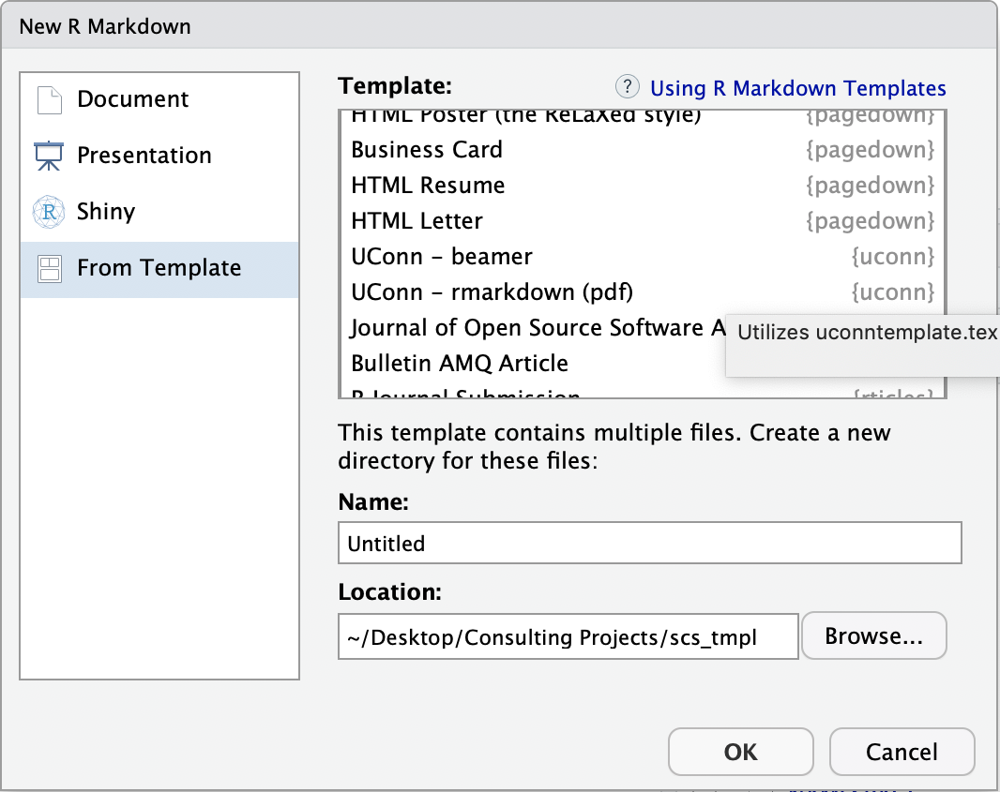

<!-- README.md is generated from README.Rmd. Please edit that file -->

```{r, include = FALSE}
knitr::opts_chunk$set(
  collapse = TRUE,
  comment = "#>",
  fig.path = "man/figures",
  out.width = "100%"
)
```

# scs_tmpl

SCS template for reports and beamers via Rmarkdown

## Installation

```{r, eval = FALSE}
#install.packages('remotes')
remotes::install_github('yuliasidi/scs_tmpl')
```

## Usage

In `RStudio` open a new `Rmarkdown` file and choose "UConn - rmarkdown (pdf)" or "UConn - beamer" from the template list.

```{r}

```

